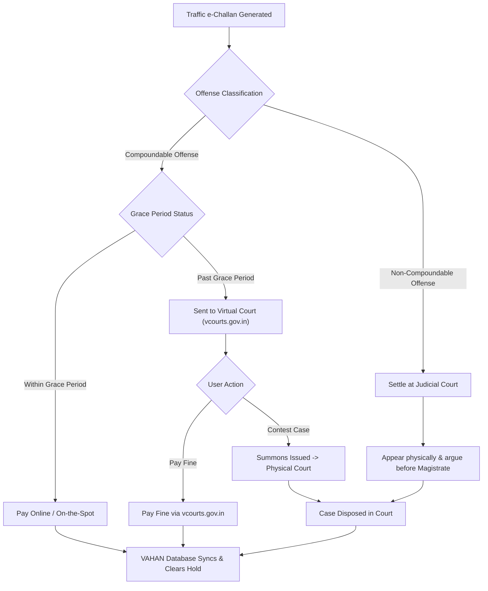
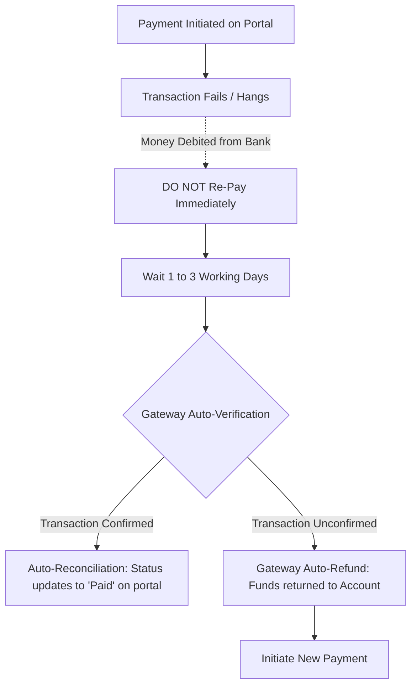

# Legal and Procedural Architecture of Traffic Enforcement in India: A Comprehensive Analysis of Offense Typologies and Settlement Channels

The enactment of the **Motor Vehicles (Amendment) Act of 2019** represented a systemic overhaul of India's approach to road safety, vehicle compliance, and administrative policing [cite: 1, 2, 3]. Prior to these amendments, the penal framework established under the original 1988 Act featured compounding fees that failed to serve as credible deterrents against reckless and non-compliant behaviors on public roadways [cite: 1, 2, 3]. With India historically positioned as a global outlier in road traffic fatalities—recording upwards of 180,000 deaths annually—the central government overhauled the penalty architecture to prioritize public safety, enforce strict documentation compliance, and implement state-of-the-art technological monitoring [cite: 1, 4, 5].

Central to this transformation was the digitization of traffic policing through the **National Informatics Centre’s (NIC) e-Challan system**, which links directly to the Ministry of Road Transport and Highways (MoRTH) central **VAHAN** and **SARATHI** databases [cite: 6, 7, 8]. This integration enables the automation of the enforcement process [cite: 9, 10]. Utilizing closed-circuit television (CCTV) cameras, speed traps, and Automated Number Plate Recognition (ANPR) systems, municipal traffic departments can generate non-contact citations based on real-time vehicle telemetry and license plate verification [cite: 1, 11, 12].

However, the scale of this automated infrastructure has exposed systemic bottlenecks [cite: 4]. Over **416 million e-challans** have been recorded historically, representing a total fine volume of approximately **₹635 billion** [cite: 6]. Despite this extensive tracking, a major policy challenge remains: **roughly 75% of these digitized traffic fines remain unpaid** [cite: 4]. This analysis provides a detailed look at the top 30 traffic offenses committed by motorists, along with the distinct online, offline, and judicial pathways available to resolve these outstanding liabilities.

---

## The Top 30 Traffic Violations and Behavioral Drivers

The compliance challenges in Indian traffic systems span three major domains: **critical safety violations**, **documentation failures**, and **socially disruptive behaviors** [cite: 13]. Motorists often commit these offenses due to a mix of economic pressures, systemic delays, and a low perception of road safety risks [cite: 1, 11, 12].

### Critical Safety and Operational Violations

The most frequent and dangerous traffic violations are those that directly threaten human life [cite: 11]. Foremost among these is riding a two-wheeler without a protective helmet, penalized under **Section 194D** with a **₹1,000 fine and a three-month license disqualification** [cite: 14, 15]. Motorists frequently bypass helmet usage during short-distance local trips, failing to recognize that a significant portion of fatal head injuries occur on municipal roads rather than high-speed highways [cite: 11]. This risk is heightened by triple riding on two-wheelers, penalized under **Section 194C** [cite: 14]. Triple riding remains a common, albeit dangerous, transit solution for low-income households [cite: 1, 11].

Similarly, failing to wear a seatbelt, penalized under **Section 194B**, remains a common compliance gap, especially among rear-seat passengers who are often unaware of the safety risks [cite: 13, 14]. This safety gap extends to children, where driving with an unsecured child under 14 years without a seatbelt or dedicated child restraint system (CRS) attracts a **₹1,000 fine under Section 194B(2)** [cite: 16, 17, 18].

Reckless on-road behaviors are also heavily penalized under the amended framework [cite: 1]. Over-speeding in a Light Motor Vehicle (LMV) attracts a fine of **₹1,000 to ₹2,000**, while medium and heavy commercial vehicles face **₹2,000 to ₹4,000 fines**, alongside potential license seizure for repeat offenses [cite: 14, 16]. Commercial operators often exceed speed limits to meet tight delivery schedules, bypassing automated speed-detecting radars [cite: 11, 18].

Drunk driving, penalized under **Section 185**, remains a major safety hazard [cite: 11]. The law establishes a strict blood alcohol concentration threshold of **30 mg per 100 ml of blood** [cite: 19, 20]. First-time offenders face a **₹10,000 fine and/or up to six months in prison**, which escalates to **₹15,000 and/or up to two years in prison** for repeat offenses within three years [cite: 14, 16].

Distracted driving is also heavily monitored [cite: 11]. Using a handheld mobile phone or communication device while driving, treated under **Section 184**, is penalized with **₹1,000 to ₹5,000** for a first offense and **₹10,000** for repeat offenses [cite: 13, 14]. This reflects the high risks associated with screen distraction in dense urban traffic [cite: 1, 11].

These behaviors are closely linked to rash or dangerous driving, also covered under **Section 184** [cite: 14, 21, 22]. Dangerous driving encompasses running red lights, unsafe overtaking, and driving against the flow of traffic (wrong-side driving) [cite: 1, 14]. Wrong-side driving, in particular, is a common local practice used to bypass lengthy U-turns, presenting severe risks on major arterials and expressways [cite: 11, 14].

Finally, racing or conducting speed tests on public roads without written government consent is penalized under **Section 189** with a **₹5,000 fine and/or up to three months in prison**, rising to **₹10,000** for repeat offenses [cite: 14, 23].

### Documentation and Vehicle Fitness Compliance

Documentation lapses represent a substantial portion of e-challans [cite: 11]. Operating a vehicle without a valid driving license attracts a **₹5,000 fine under Section 181**, which rises to **₹10,000** for repeat offenses [cite: 14, 15]. Similarly, driving without a valid Registration Certificate (RC) violates Section 39 and is penalized under **Section 192**, with fines ranging from **₹2,000 to ₹5,000** for a first offense and **₹5,000 to ₹10,000** for repeat offenses [cite: 14].

Operating an uninsured vehicle, which presents major third-party risks, is penalized under **Section 196** with a **₹2,000 fine and/or three months in prison**, rising to **₹4,000** for repeat violations [cite: 14, 15, 24]. Additionally, driving a vehicle without a valid Pollution Under Control Certificate (PUCC) attracts a **₹10,000 fine under Section 190(2)** and a **three-month license disqualification** [cite: 13, 14, 21]. While new vehicles receive a one-year PUCC, older vehicles must undergo emissions testing every six months, a requirement that motorists often neglect [cite: 14].

For commercial operators, the permit and fitness framework is strictly enforced [cite: 25]. Operating a transport vehicle without a valid permit, in violation of Section 66, is penalized under **Section 192A** with a **₹10,000 fine and/or up to six months in prison** [cite: 14, 15, 26]. Commercial vehicles must also carry a valid certificate of fitness under Section 56 [cite: 21, 27, 28]. Operating a commercial vehicle without this certificate is deemed equivalent to driving an unregistered vehicle, attracting a **₹5,000 to ₹10,000 fine under Section 192** [cite: 13, 21, 29].

Cargo and passenger limits are also closely monitored [cite: 1]. Overloading a goods vehicle under Section 194 carries a **₹20,000 basic fine plus ₹2,000 per extra metric tonne**, while overloading passengers in transport or public service vehicles carries a fine of **₹200 per extra passenger under Section 194A** [cite: 14, 15, 22]. Commercial transport operators often exceed these limits to maximize margins, despite the severe strain it places on vehicle braking systems and public road infrastructure [cite: 1, 25].

Additionally, using a private car to carry goods on a commercial basis violates its registration category and is penalized under **Section 192A with a ₹10,000 fine** [cite: 14].

### Socially and Environmentally Disruptive Violations

The traffic framework also addresses broader public safety, environmental health, and order on public roads [cite: 1, 30, 31]. A critical concern is underage or juvenile driving, governed under **Section 199A** [cite: 14, 32]. This section holds the vehicle's parent, guardian, or owner legally responsible, imposing a **₹25,000 fine, up to three years in prison, and a one-year cancellation of the vehicle's registration** [cite: 14, 33]. The minor also becomes ineligible to obtain a learner's or driving license until they turn 25 [cite: 5, 16, 33]. Under the legal precedent set by the Kerala High Court in *Sharafudheen v. State of Kerala*, parents or owners can face prosecution even before the minor is proceeded against, emphasizing the strict accountability placed on guardians [cite: 34].

Acoustic and spatial disruptions in urban environments are also heavily regulated [cite: 30]. Needless, continuous honking, using multi-toned pressure horns, or modifying exhaust systems to increase noise levels violates **Section 194F** [cite: 13, 22, 35]. This is penalized with a **₹1,000 fine for a first offense and ₹2,000 for subsequent offenses** [cite: 16, 21]. The law strictly prohibits sounding horns in designated silence zones, which extend 100 meters around hospitals, schools, courts, and religious institutions [cite: 30, 36].

Similarly, wrong or obstructive parking, penalized under Section 122 read with **Section 177**, carries a **₹500 to ₹1,500 fine** [cite: 11, 13]. In major metros like Delhi, this is often accompanied by vehicle towing charges, which range from ₹100 for two-wheelers to ₹400 for heavy passenger buses [cite: 26].

Furthermore, failing to yield the right of way to emergency vehicles, such as ambulances or fire trucks, violates **Section 194E** and carries a heavy **₹10,000 fine and/or up to six months in prison** [cite: 15, 16, 26]. Failing to maintain basic lane discipline, such as shifting lanes without signaling, is penalized under **Section 177A with a ₹500 to ₹2,000 fine** [cite: 13, 15].

Using non-compliant, decorative, or missing High Security Registration Plates (HSRP) under Section 177 read with CMVR Rule 50 carries a **₹5,000 to ₹10,000 fine**, targeting the use of customized fonts that block automated ANPR cameras [cite: 13, 22, 23]. Stopping past the designated stop line at intersections carries a **₹500 to ₹1,500 fine** under DMVR 113(1) and Section 177, representing a minor but highly automated camera-enforced offense in metropolitan smart cities [cite: 12, 13, 37].

Finally, making unauthorized structural alterations to a vehicle carries a **₹5,000 fine per alteration under Section 182A(4)** [cite: 21]. This is coupled with a **₹2,000 fine under Section 179** for disobeying a lawful order or refusing to provide information to a traffic officer [cite: 15, 21, 22].

The following table provides a comprehensive reference for these top 30 violations, detailing the relevant sections of the Motor Vehicles Act, the fine structure, and the behavioral drivers behind them.

### Top 30 Traffic Violations Reference Table

| Violation ID | Core Traffic Offense | Relevant Statutory Provision | First Offense Fine (INR) | Repeat Offense Fine (INR) | Primary Behavioral and Operational Driver |
| :---: | :--- | :--- | :--- | :--- | :--- |
| **1** | No Helmet (Rider or Pillion) | Section 129 r/w 194D [cite: 22] | ₹1,000 + 3-Month License Suspension [cite: 14, 15] | ₹1,000 + 3-Month License Suspension [cite: 14, 15] | Risk-denial and negligence during short commutes [cite: 11]. |
| **2** | No Seat Belt (Driver or Passenger) | Section 194B(1) [cite: 18] | ₹1,000 [cite: 14, 15] | ₹1,000 [cite: 14, 15] | Low perception of risk, especially among rear-seat occupants [cite: 13, 14]. |
| **3** | Unsecured Child (Under 14 Years) | Section 194B(2) [cite: 17, 18] | ₹1,000 [cite: 17] | ₹1,000 [cite: 17] | Lack of awareness regarding child restraint systems (CRS) [cite: 17]. |
| **4** | Triple Riding on Two-Wheeler | Section 128 r/w 194C [cite: 14, 22] | ₹1,000 + 3-Month License Suspension [cite: 14] | ₹1,000 + 3-Month License Suspension [cite: 14] | Economic transit alternative despite safety hazards [cite: 1, 11]. |
| **5** | Driving Without a Valid License | Section 3 r/w 181 [cite: 22] | ₹5,000 [cite: 14, 15] | ₹10,000 and/or 3 Months Jail [cite: 14] | Driving with an expired license or bypassing formal testing [cite: 3, 11]. |
| **6** | Underage / Juvenile Driving | Section 199A [cite: 14, 32] | ₹25,000 + 3 Yrs Jail (Guardian) + 1-Yr RC Cancel [cite: 14, 33] | ₹25,000 + 3 Yrs Jail (Guardian) + 1-Yr RC Cancel [cite: 14, 33] | Parental negligence and lack of oversight [cite: 32, 33]. |
| **7** | Driving Unregistered Vehicle (No RC) | Section 39 r/w 192 [cite: 21, 22] | ₹2,000 to ₹5,000 [cite: 14] | ₹5,000 to ₹10,000 and/or 1 Yr Jail [cite: 14, 25] | Delays in temporary registrations and tax avoidance [cite: 11, 25]. |
| **8** | Driving Uninsured Vehicle | Section 146 r/w 196 [cite: 19, 37] | ₹2,000 and/or 3 Months Jail [cite: 15, 24] | ₹4,000 and/or 3 Months Jail [cite: 15, 16] | Forgetting policy renewal dates [cite: 11]. |
| **9** | No Pollution Certificate (PUCC) | Section 190(2) [cite: 14, 37] | ₹10,000 + 3-Month License Suspension [cite: 13, 14] | ₹10,000 + 3-Month License Suspension [cite: 13, 14] | Bypassing the mandatory six-month testing cycle [cite: 14]. |
| **10** | Over-speeding (Light Motor Vehicle) | Section 112 r/w 183(1)(i) [cite: 21, 22] | ₹1,000 to ₹2,000 [cite: 14, 16] | ₹2,000 to ₹4,000 [cite: 14, 16] | Intentionally speeding on open expressways [cite: 11, 14]. |
| **11** | Over-speeding (Medium/Heavy Vehicle) | Section 112 r/w 183(1)(ii) [cite: 21, 22] | ₹2,000 to ₹4,000 [cite: 14, 16] | License Seizure and Higher Fine [cite: 13, 14] | Pressure to meet commercial freight delivery targets [cite: 18, 19]. |
| **12** | Drunk Driving (BAC > 30mg/100ml) | Section 185 [cite: 3, 19] | ₹10,000 and/or 6 Months Jail [cite: 14, 26] | ₹15,000 and/or 2 Yrs Jail [cite: 14] | Operating vehicles while intoxicated, often on weekends [cite: 11, 38]. |
| **13** | Handheld Mobile Phone Use | Section 184(c) [cite: 1, 22] | ₹1,000 to ₹5,000 [cite: 13, 14] | ₹10,000 (if within 3 years) [cite: 13, 14] | Texting or taking calls while navigating dense traffic [cite: 1, 11]. |
| **14** | Rash, Negligent, or Dangerous Driving | Section 184 [cite: 14, 21] | ₹1,000 to ₹5,000 and/or 1 Yr Jail [cite: 14] | ₹10,000 and/or 2 Yrs Jail [cite: 14] | Aggressive overtaking and general disregard for safety [cite: 1, 13]. |
| **15** | Speed Racing or Speed Trials | Section 189 [cite: 14, 21] | ₹5,000 and/or 3 Months Jail [cite: 14] | ₹10,000 and/or 1 Yr Jail [cite: 14] | Intentional street racing, often late at night [cite: 26, 37]. |
| **16** | Red Light / Signal Jumping | Section 184 / 177 [cite: 1, 14] | ₹1,000 to ₹5,000 [cite: 13, 14] | Higher Fine [cite: 14] | Rushing through junctions, captured by automated cameras [cite: 11, 12]. |
| **17** | Wrong-Side / One-Way Driving | Section 184 / 177 [cite: 1, 14] | ₹1,000 to ₹5,000 [cite: 14] | Higher Fine [cite: 14] | Driving against traffic to avoid taking a long U-turn [cite: 1, 11]. |
| **18** | Blocking Emergency Vehicles | Section 194E [cite: 15, 22] | ₹10,000 and/or 6 Months Jail [cite: 24, 26] | ₹10,000 and/or 6 Months Jail [cite: 24, 26] | Poor lane discipline and driver apathy [cite: 1, 11]. |
| **19** | Commercial Fitness Lapses | Section 56 r/w 192 [cite: 21, 27] | ₹5,000 to ₹10,000 [cite: 13, 21] | ₹10,000 and/or 1 Yr Jail [cite: 21, 25] | Systemic delays in safety testing for transport fleets [cite: 25, 39]. |
| **20** | Operating Commercial Vehicle w/o Permit | Section 66 r/w 192A [cite: 14, 21] | ₹10,000 and/or 6 Months Jail [cite: 14, 24] | ₹10,000 and/or 1 Yr Jail [cite: 16, 25] | Bypassing permit routes to avoid state taxation [cite: 40, 41]. |
| **21** | Overloading Cargo (Goods Vehicle) | Section 113 r/w 194 [cite: 21, 22] | ₹20,000 + ₹2,000 per extra Tonne [cite: 14, 15] | Higher Fine + Vehicle Impounded [cite: 14] | Maximizing load margins per transit run [cite: 1]. |
| **22** | Overloading Passengers (Transport) | Section 194A [cite: 14, 15] | ₹200 per extra Passenger [cite: 14] | ₹200 per extra Passenger [cite: 14] | Maximizing ticket revenue in public transport [cite: 11, 42]. |
| **23** | Carrying Goods in Private Passenger Car | Section 192A [cite: 14] | ₹10,000 [cite: 14] | ₹10,000 [cite: 14] | Using private passenger cars for commercial deliveries [cite: 14]. |
| **24** | Needless Honking / Silent Zone Use | Section 194F [cite: 16, 22] | ₹1,000 [cite: 16, 21] | ₹2,000 [cite: 16, 21] | Habitual honking in heavy traffic [cite: 30, 35]. |
| **25** | Non-Compliant / Decorative Plate (HSRP) | CMVR 50 r/w Sec 177 [cite: 22, 23] | ₹5,000 to ₹10,000 [cite: 13] | ₹5,000 to ₹10,000 [cite: 13] | Delays in fitting standard HSRP plates [cite: 13, 23]. |
| **26** | Stop Line Violation at Intersections | CMVR 113(1) r/w Sec 177 [cite: 13, 37] | ₹500 [cite: 13, 37] | ₹1,500 [cite: 13, 37] | Creeping past stop lines, caught by junction cameras [cite: 12, 13]. |
| **27** | Wrong, Obstructive, or No-Parking Parking | Section 122 r/w 177 [cite: 11, 43] | ₹500 to ₹1,500 [cite: 11, 13] | ₹500 to ₹1,500 (+ Towing Fees) [cite: 13, 26] | Double-parking due to a shortage of urban spaces [cite: 4, 11]. |
| **28** | Unauthorized Alterations / Modifications | Section 182A(4) [cite: 21, 43] | ₹5,000 per alteration [cite: 21] | ₹5,000 per alteration [cite: 21] | Performance tuning or structural changes to vehicles [cite: 11, 13]. |
| **29** | Improper Lane Changes / Discipline | Section 177A [cite: 13, 15] | ₹500 to ₹2,000 [cite: 13] | ₹500 to ₹2,000 [cite: 13] | Changing lanes without signaling or occupying fast lanes [cite: 13, 26]. |
| **30** | Disobeying Orders / Refusing Info | Section 179 [cite: 15, 21] | ₹2,000 [cite: 15, 21] | ₹2,000 [cite: 15, 21] | Attempting to evade on-road verification [cite: 16, 44]. |

---

## Procedural Payment Modalities and Channels

Motorists in India have several digital, manual, and judicial pathways to resolve their traffic challans [cite: 7, 8, 9]. Understanding these channels is crucial, as the choice of payment method depends heavily on the source and nature of the citation [cite: 7, 8, 9].

### Process Flow Diagram: Traffic e-Challan Adjudication Pathways

### The Central Government e-Challan Portal (Parivahan Sewa)

The primary digital channel is the central **Parivahan Sewa e-Challan portal** (`echallan.parivahan.gov.in`), developed by the Ministry of Road Transport and Highways (MoRTH) [cite: 6, 7]. This national platform consolidates traffic citations across almost all states and union territories, providing a unified database for motorists to check and settle their fines [cite: 7, 45].

To access the system, users input their unique challan number, vehicle registration number (backed by the last five digits of the engine or chassis number), or their driving license (DL) number [cite: 7, 9]. After passing a secure CAPTCHA verification, the portal retrieves all pending and cleared citations linked to the vehicle [cite: 7, 9]. For active compoundable fines, the portal displays a 'Pay Now' button [cite: 7]. This button redirects users to a government-integrated payment gateway, primarily powered by SBI ePay, where transactions are processed securely via UPI, debit/credit cards, or net banking [cite: 7, 9].

Once payment is confirmed, a digital, court-admissible receipt is generated instantly, and the platform initiates the status sync to clear the citation on the VAHAN database [cite: 7, 9].

### State-Specific Transport and Traffic Police Portals

While the national Parivahan portal serves as the primary system, several state transport departments and municipal traffic police divisions maintain independent portals to manage local citations [cite: 46, 47]. For instance, Maharashtra, Uttar Pradesh, West Bengal, and Tamil Nadu run dedicated platforms tailored to their local administrative needs [cite: 46, 47, 48].

These regional portals allow motorists to settle localized municipal parking fines, spot citations, and electronic camera violations that may take time to sync with the central federal database [cite: 46, 47]. The process on these state sites mirrors the national portal [cite: 47]. Users query their vehicle or notice number, verify the outstanding penalty, and complete the payment using localized state treasury gateways [cite: 47].

### Integrated Mobile Wallets and UPI Applications

To make payment more accessible, the government has integrated e-challan systems with popular third-party financial applications through open API structures [cite: 49]. Mobile wallets and UPI-centric applications, such as Paytm, Google Pay, and HDFC PayZapp, feature dedicated 'Traffic Challan' bill-payment sub-sections [cite: 46, 48, 49].

Within these applications, users select their respective state or municipal traffic authority (e.g., Delhi Traffic Police or State Traffic Branch Gujarat) and input their vehicle or challan details [cite: 48, 49]. The application queries the e-challan database in real-time, displays the pending penalty, and allows the user to complete the transaction directly via UPI, stored credit cards, or mobile wallets [cite: 7, 48, 49].

These commercial platforms have gained popularity among smartphone users due to their one-click payment flows, instant receipts, and transactional history tracking [cite: 7, 46, 49].

### Automotive Aggregator and Transaction Platforms

For vehicle owners looking to buy or sell used cars, specialized automotive transaction platforms like Cars24 and Spinny have integrated e-challan retrieval and payment services [cite: 7, 10, 50].

Because outstanding traffic citations block vehicle title transfers, registration renewals, and structural ownership changes, these platforms run background check integrations [cite: 7, 51, 52]. Users can enter their vehicle's registration number on these apps to retrieve all outstanding citations in a clean, readable format [cite: 7, 10, 50].

These platforms then allow users to settle all outstanding fines in a single transaction, using integrated legal support and secure payment routing to ensure the vehicle is cleared for resale [cite: 7, 10].

### On-the-Spot Cash or Card Settlement with Enforcement Officers

For manual, on-road enforcement, traffic police officers are equipped with handheld digital e-challan swiping terminals [cite: 2, 9]. When an officer intercepts a motorist for an active violation, they enter the driver's license or vehicle registration into the handheld terminal [cite: 9, 47]. This retrieves both the immediate offense and any older, unpaid citations linked to the vehicle [cite: 2].

The motorist can pay the compounding fee on the spot [cite: 9, 47]. These terminals process payments via debit/credit cards or generate a dynamic on-screen UPI QR code for the driver to scan and pay [cite: 7, 47]. Once the payment is processed, the officer issues a physical, system-generated paper receipt on the spot [cite: 9, 47]. This instant payment route resolves the infraction immediately, preventing any future referral to court [cite: 2, 9, 47].

### Physical Visits to Traffic Police Stations or RTO Headquarters

For motorists who prefer manual cash transactions or are clearing complex, documentation-heavy violations, visits to localized traffic police stations or Regional Transport Office (RTO) headquarters remain a standard pathway [cite: 9, 10, 47].

Motorists bring their physical e-challan notice, driving license, and vehicle documents to the designated accounting counter of the local traffic office [cite: 47]. After a verification check by the desk officer, the driver pays the compounding fee in cash or via a physical check [cite: 47]. The station officer then stamps the e-challan as resolved, processes the receipt manually, and updates the state transport ledger to clear the hold on the vehicle [cite: 47].

### The Virtual Courts Portal (vcourts.gov.in)

For citations that remain unpaid past their standard 45-to-60-day grace period, the e-challan system automatically locks the standard payment portals and refers the case to the Virtual Court system [cite: 8]. Developed by the National Informatics Centre (NIC) under the e-Courts project of the Supreme Court of India, the Virtual Court platform (`vcourts.gov.in`) allows a designated judge to adjudicate minor, uncontested traffic cases digitally, eliminating the need for physical court visits [cite: 8, 9].

Once a case is transferred, the portal issues a virtual summons to the driver's registered mobile number [cite: 8, 53]. Motorists log on to the portal and locate their case using their unique CNR number, vehicle registration, or mobile number [cite: 8, 45].

The platform displays the specific offense details and the fine proposed by the presiding judge [cite: 8]. The citizen can then:
1. **Accept the summons**, pay the proposed fine through the secure ePay portal using UPI or net banking, and immediately close the case with a downloadable court disposal order [cite: 8, 53].
2. **Choose to contest the case**, which automatically routes the matter to the physical jurisdiction of a local magistrate court, assigning a specific court name and hearing date [cite: 7, 53].

If the mobile number in the VAHAN database is incorrect, the virtual court platform allows drivers to complete OTP verification using the unique engine and chassis numbers of the vehicle, ensuring they can still access and settle their cases online [cite: 53].

### National Lok Adalats (Quarterly Waiver Drives)

To clear the massive backlogs of unpaid traffic citations, the State and District Legal Services Authorities organize **National Lok Adalats (People's Courts)** four times a year under the Legal Services Authorities Act, 1987 [cite: 52, 54, 55].

Lok Adalats serve as alternative, conciliatory dispute resolution forums where citizens can settle eligible pending traffic challans with waivers or discounts ranging from **30% to 70% of the total fine amount** [cite: 50, 52, 55]. Only compoundable, non-serious offenses—such as overspeeding, signal jumping, and seatbelt or helmet violations—are eligible for settlement [cite: 52, 56]. Serious offenses like drunk driving, rash driving, and accident-related cases are strictly excluded [cite: 52, 55].

In high-density jurisdictions like Delhi, participation in Lok Adalats requires mandatory online pre-booking due to the extreme volume of pending cases [cite: 56, 57]. During these drives, the Delhi Traffic Police activates a dedicated token booking link on its portal (`traffic.delhipolice.gov.in/lokadalat`) [cite: 56, 58]. The system operates on a first-come, first-served basis, offering a maximum of 50,000 tokens daily up to a total cap of 200,000 challans per session [cite: 56, 58].

Motorists must download and print their official token and challan slips prior to attending [cite: 58]. On the designated day, citizens present these printouts to the assigned Lok Adalat bench within the district court complexes (such as Tis Hazari, Saket, or Dwarka) [cite: 56, 57, 58]. No printing facilities are provided on-site, and walk-ins are not accepted [cite: 56, 58]. Once a settlement is reached, the reduced fine is paid at the court counter, and a court-stamped receipt is issued, closing the case with final, binding authority [cite: 55, 56, 59].

### Permanent Lok Adalats (Public Utility Settlements)

Permanent Lok Adalats function as continuous, pre-litigative conciliation bodies established to settle disputes involving public utility services, which include public transport and passenger carriage networks [cite: 54, 59].

When commercial transport operators, fleet owners, or public carriage drivers face multiple structural, permit-based, or systemic challans, they can approach a Permanent Lok Adalat [cite: 54, 59]. These bodies are led by a Chairman and two appointed members, operating under a monetary jurisdiction of up to ₹1 crore in key metropolitan centers like Delhi [cite: 54].

If the transport department and the vehicle owner fail to reach a mutual compromise, the Permanent Lok Adalat holds the unique statutory authority to decide the case on its merits, issuing a final, binding award that carries the same authority as a civil court decree [cite: 54, 59].

### Physical Referrals to Regular Judicial Magistrate Courts

When a traffic offense is of a non-compoundable nature (e.g., drunk driving under Section 185, carrying hazardous materials without safety equipment under Section 190(3), or involvement in a serious accident), the citation cannot be settled online or compounded at a police station [cite: 14, 22, 55].

The e-challan is marked as a 'Court Challan' and referred directly to the physical jurisdiction of the local Judicial Magistrate Court [cite: 7, 22]. The driver must appear physically before the magistrate on the assigned date [cite: 7].

The court conducts a formal hearing where the driver can present their defense or plead guilty [cite: 53, 60]. The magistrate then determines the final penalty, which may include high fines, license suspension, community service, or physical imprisonment [cite: 14, 16, 24]. Once the court's judgment is complied with and any fine is paid, the court issues a manual disposal order to clear the vehicle's record on the VAHAN database [cite: 8].

### Summary of Procedural Settlement Modalities Table

| Modality ID | Settlement Channel | Primary Access Interface | Core Operational Purpose | Standard Adjudication / Waiver Rules |
| :---: | :--- | :--- | :--- | :--- |
| **1** | National Parivahan Portal | `echallan.parivahan.gov.in` [cite: 7] | Standard online payment for all active compoundable fines [cite: 7, 52]. | Full statutory fine amount; processed via SBI ePay gateway [cite: 7, 9]. |
| **2** | State-Specific Portals | State Police/RTO Apps & Sites [cite: 46, 47] | Settle localized municipal parking or spot fines [cite: 46, 47]. | Subject to state-specific compounding schedules and local treasury guidelines [cite: 14, 47]. |
| **3** | Third-Party Mobile Wallets | Paytm, Google Pay, HDFC PayZapp [cite: 46, 48, 49] | Quick, one-click mobile UPI payments [cite: 7, 49]. | Direct billing extraction from central API; no waivers or discounts [cite: 48, 49]. |
| **4** | Automotive Platforms | Cars24, Spinny Portal Integrations [cite: 7, 10] | Settle outstanding fines before vehicle sale or transfer [cite: 7, 10]. | Full payment of historical backlog to clear administrative blocks [cite: 7, 10, 51]. |
| **5** | On-the-Spot Mobile Terminals | Physical Handheld POS Devices [cite: 2, 9] | Instant, roadside payment to intercepting officers [cite: 9, 47]. | Standard compounding rate; immediate clearing on VAHAN ledger [cite: 2, 9]. |
| **6** | Physical Police Stations | Local Traffic Precinct Counters [cite: 47] | Manual cash payments and physical document verification [cite: 47]. | Standard statutory compounding; receipt stamped on-site [cite: 47]. |
| **7** | Virtual Courts Portal | `vcourts.gov.in` [cite: 8, 45] | Digital resolution of minor, uncontested referred cases [cite: 8, 9]. | Judge-proposed fine; payment disposes of the case immediately [cite: 8, 53]. |
| **8** | National Lok Adalats | Quarterly Legal Services Benches [cite: 52, 55] | Rapid, mass clearance of old, unpaid compoundable cases [cite: 50, 52]. | Offers 30% to 70% waivers; requires online token pre-booking [cite: 52, 56]. |
| **9** | Permanent Lok Adalats | Specialized Utility Dispute Benches [cite: 54, 59] | Settle complex disputes for transport/public utility fleets [cite: 54, 59]. | Conciliation-focused; holds authority to issue binding awards [cite: 54, 59]. |
| **10** | Judicial Magistrate Courts | Physical District Courtrooms [cite: 7, 22] | Adjudicate serious, non-compoundable offenses [cite: 22, 55]. | Penalties determined by magistrate, including jail, community service, or high fines [cite: 14, 16, 24]. |

---

## Technical Resolution of Failed Transactions and Payment Discrepancies

Given the high volume of transactions processed daily across India’s digital payment gateways, technical failures and payment discrepancies are common [cite: 9]. A major issue is the failed transaction loop, where a motorist attempts to pay an e-challan online, the money is debited from their bank account, but the payment status fails to update on the Parivahan portal [cite: 9].

In such cases, transport authorities recommend that users do not make an immediate duplicate payment [cite: 9]. Instead, they should wait one to three working days for the system to reconcile [cite: 9]. During this window, the payment gateway (such as SBI ePay) automatically verifies the transaction status with the user's bank [cite: 9]. If the transaction is confirmed, the status is updated to 'Paid'; if the transaction fails, the debited amount is auto-refunded to the user's account [cite: 9].

Motorists can monitor this status by selecting the "Check Failed Transaction" or "Check Pending Transaction" options under the online services dropdown menu on the Parivahan portal [cite: 10].

### Process Flow Diagram: Failed Transaction Reconciliation Loop

If the transaction remains stuck or fails to update after three working days, the portal provides an online grievance redressal mechanism [cite: 9]. Under the "Grievance" tab on the Parivahan portal, users can log a formal complaint by entering the unique challan, vehicle, or driving license details [cite: 9].

The user must describe the issue and upload supporting documents, such as a PDF of their bank statement showing the debit transaction, the transaction ID, and the failed screen prompt [cite: 9]. Once submitted, the system generates a unique grievance ticket number [cite: 9, 10]. The user can track this ticket on the portal to monitor its review and resolution by the transport department's technical team [cite: 10].

Additionally, if an e-challan has been issued incorrectly due to a system or clerical error—such as an automated camera misreading a license plate—the grievance portal serves as the primary channel to contest the ticket before it is referred to court [cite: 2, 7].

The vehicle owner can submit a dispute request along with photographic evidence, proof of the vehicle's actual registration plate, or GPS logs showing the vehicle was elsewhere at the time of the recorded infraction [cite: 2, 7]. Local transport authorities review these submissions and, if verified, hold the authority to cancel the e-challan directly, updating the VAHAN database to clear the vehicle's record [cite: 2].

---

## Strategic Implications and Compliance Interlocks

The high volume of unpaid traffic challans has led transport departments to implement systemic compliance interlocks [cite: 4, 51]. These interlocks connect e-challan databases with essential vehicle and insurance services to ensure payment compliance [cite: 37, 51, 52].

### Vehicle Transaction and Transfer Blockages

The primary administrative tool to enforce e-challan compliance is the integration of outstanding fines with vehicle transaction services on the VAHAN portal [cite: 7, 51, 52].

When a vehicle has multiple unresolved traffic challans, particularly those referred to Virtual Courts or regular magistrate courts, the central system automatically flags the vehicle [cite: 7, 52]. This block prevents the owner from accessing key administrative services [cite: 51, 52]. Specifically, the VAHAN system will deny applications for:
- **Transfer of vehicle ownership** (Registration Certificate transfers) during resale [cite: 7, 51, 52].
- **Address updates** in the Registration Certificate [cite: 61].
- **Issuance or renewal of commercial permits and vehicle fitness certificates** [cite: 52, 62].
- **Renewal of registration marks** for older vehicles [cite: 55].

These blocks present a major challenge for used car sales, as registered dealers and buyers will reject vehicles with outstanding citations [cite: 7, 51]. Owners must settle all outstanding fines, clear any court summons, and present a clean record before the VAHAN system will allow the transaction to proceed [cite: 7, 8, 52].

### Insurance Claim Rejections and Premium Interlocks

The Motor Vehicles Act of 2019 has also reinforced the link between traffic violations and insurance compliance [cite: 1, 19, 37]. Under **Section 146**, every motor vehicle operating on public roads must carry active third-party insurance [cite: 3, 19]. Failing to carry valid insurance is penalized under **Section 196**, making drivers personally liable for any damages in the event of an accident [cite: 15, 19].

Furthermore, insurance providers are increasingly using e-challan databases to evaluate risk and assess claims [cite: 14, 63]. If a vehicle is involved in an accident while operating with serious outstanding safety violations—such as driving without a valid fitness certificate, bypassing structural safety norms, or operating with an expired permit—the insurer holds the legal right to reject any own-damage claims outright [cite: 14, 25].

Additionally, current policy initiatives aim to link insurance premium pricing directly to a driver's traffic offense history [cite: 37]. Under this model, drivers with a history of citations for overspeeding, drunk driving, or reckless behavior will face significant premium hikes, creating a continuous financial incentive for safe driving [cite: 37].

### Systemic Implications of Lok Adalat Waitlists

While National Lok Adalats are highly effective at clearing massive backlogs, their predictable quarterly schedule has created an unintended behavioral trend [cite: 50, 52, 55].

Knowing that these drives offer steep fine waivers, many motorists deliberately delay paying their standard e-challans, choosing to wait for the next Lok Adalat session to settle their fines at a discount [cite: 52, 55]. This strategic delay weakens the immediate deterrent effect of the high penalties introduced in 2019, turning traffic enforcement into a cyclical, discount-reliant collection process [cite: 1, 52, 55].

To address this challenge, transport and legal authorities are refining the eligibility rules for Lok Adalats [cite: 50, 52]. This includes restricting fine waivers to first-time, minor offenders, while repeat violators must pay the full statutory penalties, maintaining the integrity of the enforcement system [cite: 38, 52, 55].

---

## References & Statutory Sources

1. [Motor Vehicle Act 2019 and the Traffic Violation Rules - IndusInd General Insurance](https://www.indusindinsurance.com/insurance/knowledge-center/blogs/motor-vehicle-act-2019-traffic-violation-rules-and-fines.aspx)
2. [How To Pay E Challan Online and Offline - Aditya Birla Capital](https://www.adityabirlacapital.com/abc-of-money/how-to-pay-traffic-challan-online-and-offline)
3. [Motor Vehicle Act, 1988: Overview, Amendments, and Key Rules - Aditya Birla Capital](https://www.adityabirlacapital.com/abc-of-money/motor-vehicle-act)
4. [India's e-challan dilemma: 75% of traffic fines remain unpaid despite digitisation](https://the-captable.com/2025/05/india-traffic-fine-e-challan-payment-fastag/)
5. [After a juvenile commits an offence under section 199A, the - Testbook](https://testbook.com/question-answer/after-a-juvenile-commits-an-offence-under-section--6933bac2acf6ace2b3b89b37)
6. [Indian Traffic E-Challan Daily Dataset (2015–2026) - Kaggle](https://www.kaggle.com/datasets/bhanageviraj/indian-traffic-e-challan-daily-dataset-20152026)
7. [Check E Challan Online & Pay in India - Get e-Challan Status by Vehicle Number | Spinny](https://www.spinny.com/e-challan/)
8. [The Role of Virtual Courts in Settling Traffic Challans: How E-Courts Work - CarInfo](https://www.carinfo.app/blog/challan/the-role-of-virtual-courts-in-settling-traffic-challans-how-e-courts-work)
9. [e Challan Status - Check & Pay Traffic Challans Online by Vehicle Number - Policybazaar](https://www.policybazaar.com/rto/challan-status/)
10. [Check & pay traffic challan in Uttar Pradesh - Cars24](https://www.cars24.com/uttar-pradesh-traffic-challan-status/)
11. [Most Common Traffic Challans in India and How to Avoid Them - Spinny](https://www.spinny.com/blog/most-common-traffic-challans-in-india-and-how-to-avoid-them/)
12. [IIIT Hyderabad's Fine Analysis Of Traffic Violations](https://www.iiit.ac.in/e-challan/)
13. [Guide to Traffic Rules, Violations and Fines in India 2026 - DigiLawyer](https://digilawyer.ai/blogs/traffic-violations-fines-india)
14. [Maharashtra Traffic Fines List 2026: Rules, Penalties & E-Challan Payment | Zurich Kotak](https://www.zurichkotak.com/knowledge-center/rto/maharashtra-traffic-fine)
15. [Motor Vehicles (Amendment) Act, 2019 – Revised Penalties for Traffic Violations](https://singhania.in/news/motor-vehicles-amendment-act-2019-revised-penalties-for-traffic-violations)
16. [Revised Penalties under amended Motor Vehicles Act - Social Welfare - Vikaspedia](https://socialwelfare.vikaspedia.in/viewcontent/social-welfare/social-awareness/consumer-education/safe-driving/revised-penalties-under-amended-motor-vehicles-act?lgn=en)
17. [Under section 194B(2), driving with an unsecured child under - Testbook](https://testbook.com/question-answer/under-section-194b2-driving-with-an-unsecured-c--6933babe34b123663904b01e)
18. [Stakeholder Comments On The Proposed Amendments To The Motor Vehicles Act, 1988(“MV Act”) - CAG](https://www.cag.org.in/sites/default/files/database/MVA%20representation.pdf)
19. [Bangalore Traffic Fines - Latest Challan Rates Guide 2026](https://www.bajajgeneralinsurance.com/blog/motor-insurance-articles/bangalore-traffic-fines.html)
20. [MVA : Offences, Penalties And Procedure - Devgan.in](https://devgan.in/mva/chapter_13.php)
21. [Traffic Offences and Penalties - West Bengal Traffic Police](https://www.wbtrafficpolice.com/offences-and-penalties.php)
22. [Traffic Rules And Regulations - Andaman & Nicobar Police Website](https://police.andamannicobar.gov.in/index.php/en/rules-regulations/traffic-rules-and-regulations.html)
23. [detail of compounding charges(shaman shulk) against challans for the traffic rules violations - UP Police](https://uppolice.gov.in/site/writereaddata/RTI/RTI_201803191216313459.pdf)
24. [Traffic Offences and Penalties in Delhi - BankBazaar](https://www.bankbazaar.com/car-insurance/traffic-offences-and-fines-in-delhi.html)
25. [Kaushalpati Pandey vs New India Ass. Co. Ltd. & Ors on 9 November, 2020 - Indian Kanoon](https://indiankanoon.org/doc/170513536/)
26. [Traffic Rules and Traffic Violations in Delhi - ACKO Drive](https://ackodrive.com/traffic-rules/delhi/)
27. [Section 56 of MV Act | Indian Case Law - CaseMine](https://www.casemine.com/search/in/Section%2B56%2Bof%2BMV%2BAct)
28. [IN THE HIGH COURT OF JUDICATURE AT BOMBAY PIL NO.28 OF 2013 - Road Safety Network](https://www.roadsafetynetwork.in/wp-content/uploads/2019/01/shrikant-karve-PIL-28-of-2013.pdf)
29. [Section 192 - India Code](https://www.indiacode.nic.in/show-data?actid=AC_CEN_30_42_00009_198859_1517807326286&sectionId=28468&sectionno=192&orderno=212)
30. [Mohan Krishna H vs The Union Of India on 17 February, 2021](https://indiankanoon.org/doc/193667540/)
31. [Report on Analysis of status of Road Safety Laws and Policies - Consumer Voice](https://consumer-voice.org/wp-content/uploads/2023/10/Road-safety-policy-gap-study-Final-report.pdf)
32. [As per section 199A concerning offences by juveniles - Testbook](https://testbook.com/question-answer/as-per-section-199a-concerning-offences-by-juvenil--6933bac2558fc98ec22b30aa)
33. [Under Section 199 of the Motor Vehicles Act, 2019, who is held responsible - Testbook](https://testbook.com/question-answer/under-section-199-of-the-motor-vehicles-act-2019--691db50c51bae74409d70d31)
34. [Amendments in New Criminal Laws and Its Effect on Juvenile Justice System - Judicial Academy Jharkhand](https://jajharkhand.in/wp-content/uploads/2025/06/2nd-Techical-Session.pdf)
35. [Chapter 5 Enforcement Activities - Comptroller and Auditor General of India](https://cag.gov.in/uploads/download_audit_report/2025/10_Chapter_5-069b034a06c04f7.23178326.pdf)
36. [Noise Pollution Archives - Nyaaya](https://nyaaya.org/themes/noise-pollution/)
37. [Updated Fine List for Traffic in 2026: New Rules and More](https://www.bajajgeneralinsurance.com/blog/motor-insurance-articles/traffic-challan-fines-india-latest-updates.html)
38. [Analyzing Traffic Violations through e-challan System in Metropolitan Cities - OpenReview](https://openreview.net/attachment?id=fxXT9RcmRc&name=pdf)
39. [CHAPTER-V TAXES ON VEHICLES - CAG](https://cag.gov.in/uploads/download_audit_report/2016/Chapter_5_Taxes_on_Vehicles.pdf)
40. [The Motor Vehicles Act, 1988 Set -10 | Vidhi Judicial Academy](https://vidhijudicial.com/the-motor-vehicles-act,-1988-set-10.html)
41. [P.K.Santhosh vs State Of Kerala on 3 October, 2019](https://indiankanoon.org/docfragment/179607878/?formInput=1988%201%20KLT%20131)
42. [M.V Act - Hyderabad Traffic Police - Challan](https://echallan.tspolice.gov.in/htp/mvact.html)
43. [Traffic Offences & Penalties - Chandannagar Police Commissionerate](https://chandannagarpolice.wb.gov.in/TrafficOffencesAndPenalties)
44. [Traffic Fines - List of Traffic Violation & Fines in India 2026 - BankBazaar](https://www.bankbazaar.com/driving-licence/traffic-fines.html)
45. [Virtual Courts Portal - Official Website](https://vcourts.gov.in/)
46. [How to Pay e-Challan Online in India: Step-by-Step Guide - Creckk](https://creckk.com/blog/details/how-to-pay-e-challan-online-in-india-step-by-step-guide)
47. [How to Pay Traffic Challan Online and Offline - Bajaj Finserv](https://www.bajajfinserv.in/insurance/how-to-pay-traffic-challan-online-and-offline)
48. [E-Challan Payment Portal - Paytm](https://paytm.com/challan-bill-payment)
49. [How to Make Challan Payment Online - HDFC Bank PayZapp](https://www.hdfc.bank.in/blogs/payzapp/how-to-make-challan-payment-online)
50. [Lok Adalats & Traffic Challans: Fast-Track Justice or a Grey Area in Legal Boundaries?](https://www.lawyered.in/legal-disrupt/articles/lok-adalat-traffic-challans-fast-track-justice-india)
51. [12 States Account for 80% of India's Traffic Challans in 2025 - Cars24](https://www.cars24.com/article/12-states-account-for-80-percent-challans/)
52. [National Lok Adalat 2025: Settle Traffic Challans with Waivers and Reductions](https://www.coverfox.com/news/lok-adalat-2025-traffic-challan-waiver-reduction/)
53. [Virtual Courts Help & FAQs - vcourts.gov.in](https://vcourts.gov.in/virtualcourt/help.php)
54. [Lok Adalat Information - Delhi State Legal Services Authority](https://dslsa.org/national-lok-adalat/)
55. [Lok Adalat Challan Chennai 2026: Dates, Process - ChallanWala](https://www.challanwala.com/blogs/lok-adalat-challan-chennai-dates-process-benefits)
56. [Lok Adalat for Delhi Challan Token Registration - DigiLawyer](https://digilawyer.ai/latest-announcements/national-lok-adalat-challan-settlement-dates)
57. [Delhi Lok Adalat Challan Waiver Guide - Fateh Legacy](https://fatehlegacy.in/blogs/delhi-lok-adalat-challan-waiver-2025)
58. [Delhi Traffic Lok Adalat Token Date: Check link & download challan slip - The Economic Times](https://m.economictimes.com/news/new-updates/delhi-traffic-lok-adalat-token-date-check-link-to-download-challan-slip-directly-eligibility-places-where-settlements-are-taking-place-and-more/articleshow/129311261.cms)
59. [Lok Adalats Overview - National Legal Services Authority (NALSA)](https://nalsa.gov.in/lok-adalats/)
60. [Unsafe Lane Changes - Legal Assist & Rules](https://www.anthemeap.com/learn/find-legal-support/resources/criminal-law/legal-assist/unsafe-lane-changes)
61. [Motor Vehicles Amendment Act 2019 Overview - Scribd](https://www.scribd.com/document/836248065/MVAA-Act-19)
62. [Lok Adalat Challan Settlement in Chennai - Spinny](https://www.spinny.com/blog/lok-adalat-challan-chennai/)
63. [Traffic Rules In Maharashtra: New List Of Rules And Fines For Violations - HDFC ERGO](https://www.hdfcergo.com/blogs/car-insurance/traffic-rules-in-maharashtra)
